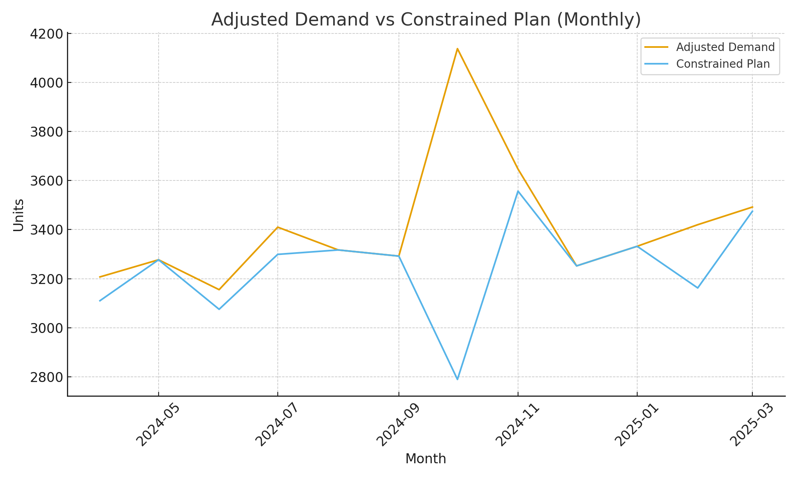
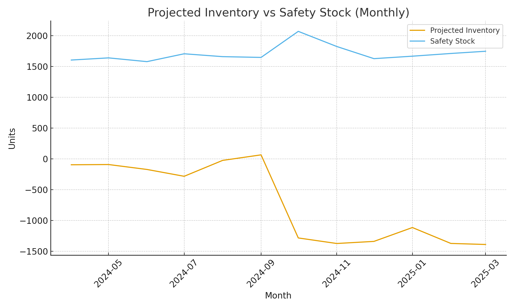
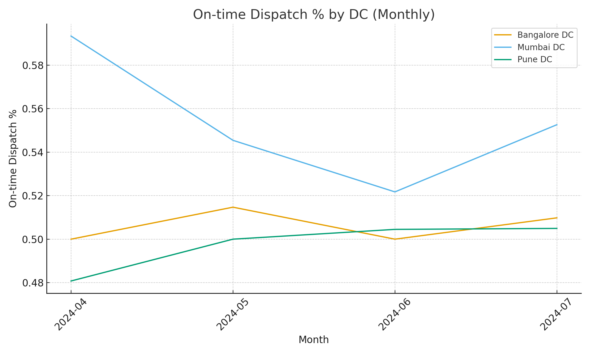

# Mini Supply Chain Portfolio — Abhijit Kapse

## 1) S&OP Planning Workbook (Excel)
- Aligns demand, capacity, and safety stock into one feasible monthly plan.
- What-if sliders: **Demand Uplift %**, **Capacity Change %**, **Safety Stock (days)**.
- Outputs: **Constrained Plan**, **Projected Inventory**, **Stockout Flags**.

## 2) Operations KPI Dashboard (Excel)
- KPIs: **On-time Dispatch % (OTD)**, **OTIF %**, **Pick/Pack TAT (min)**, **Fill Rate**.
- Monthly comparison by DC (Pune, Mumbai, Bangalore).

---
### How I’d use this in your team (DHL / Maersk / Delhivery)
- **Morning huddle:** yesterday’s OTD%, top exceptions, pick/pack bottlenecks.
- **Weekly S&OP:** run demand/capacity what-ifs, tune safety-stock policy, publish a constrained plan.

### Files
- `SOP_Workbook.xlsx` — S&OP model (instructions in its README sheet).
- `Ops_KPI_Dashboard.xlsx` — KPI model (instructions in its README sheet).
Data notice: The datasets in this repository are synthetic/anonymized, created for learning and demonstration. They mimic realistic patterns and a standard 12-month S&OP horizon; they are not from any employer.
